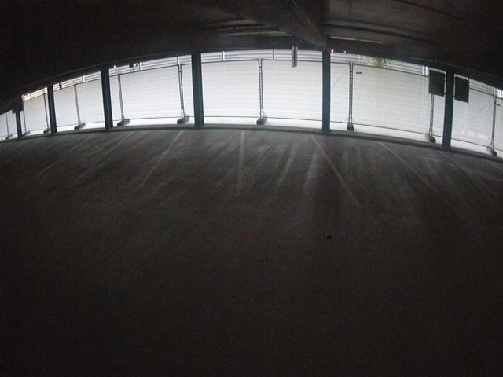
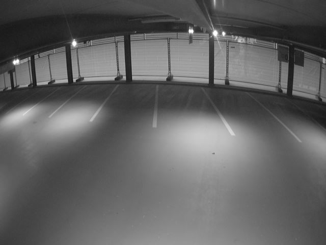
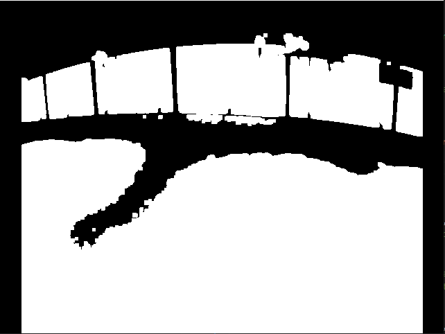
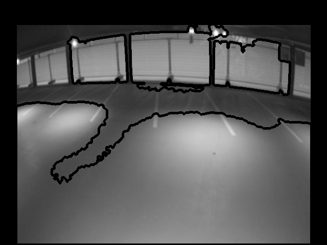

# Find and remove all the similar and duplicate images
Identifies similar images in a given folder and copies all the unique images to the results folder.

Given a folder path containing multiple similar images (like images clicked with a CC camera in a parking lot at different intervals), this code copies all the unique frames to the results folder. However, it is important that all the images in the folder are readable. This code does not handle such cases and hence all the non-readable or corrupted image frames are safely ignored with the _try-except_ block. 

This repository was written and tested on _python 3.9.4_ and _windows 10_. This repo assumes that _openCV_ library is already installed on your machine.
## Install required dependencies
Open the terminal and enter the following commands to install additional libraries to execute the code.

```
pip install pathlib
pip install tqdm
```

## Run code
```
python ./main.py <path_to_image_directory> <path_to_results_directory> <minimum_contour_area> <similarity_score_threshold>
```

For example, if the path to the image directory and result directory are _D:\dataset-candidates-ml\dataset_ and _D:\dataset-candidates-ml\dataset\results_ respectively. The minimum contour area to contribute to the overall score is _5000_ and the threshold value of the score is _50000_. Then the _main.py_ can be executed as:

```
python ./main.py D:\dataset-candidates-ml\dataset D:\dataset-candidates-ml\dataset\results 5000 50000
```

## Output
After executing the _main.py_ code, the output images are stored in the results directory.

As shown below, two image frames are captured by a camera at different time steps as _previous frame_ and _current frame_.  
<div align="center">
  <table border="0">
    <tr>
        <td><p></p></td>
        <td><p></p></td>
    </tr>
    <tr>
        <td>Previous frame</td>
        <td>Current frame</td>
    </tr>
  </table>
</div>

To identify and quantify structural information differing in various spatial regions of both frames, the following steps are followed:
1. Both the frames are preprocessed, like the conversion of RGB to Grayscale and applying _Gaussian blurring_ operation to smoothen the frames thereby reducing noise.
2. Absolute difference is computed over the preprocessed image frames. Since the background is stationary, the abs difference subtracts the unnecessary and stationary information.
3. Thresholding operation is performed on the computed background suppressed frame to yield a binary image, as shown below.
4. Morphological operation (dilation) is performed to get a more prominent image and contours are extracted.
5. All the contour areas (which are greater than the given _minimum_contour_area_) are aggregated to give a final score. If the final score is above a threshold, called _score_threshold_, then the frame is considered to be unique when compared to the previous frame. The image below illustrates the resultant contours on the _current frame_.

<div align="center">
  <table border="0">
    <tr>
        <td><p></p></td>
        <td><p></p></td>
    </tr>
    <tr>
        <td>Threshold image</td>
        <td>Contours on current frame</td>
    </tr>
  </table>
</div>
